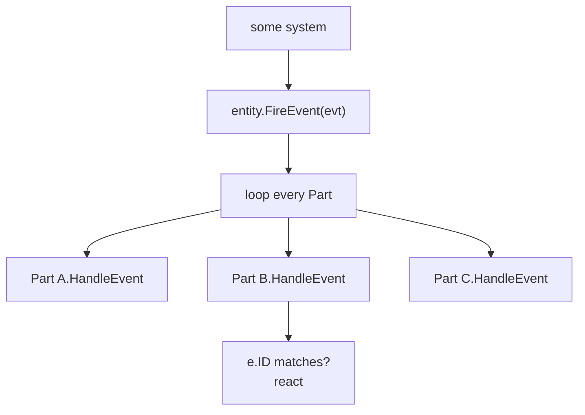
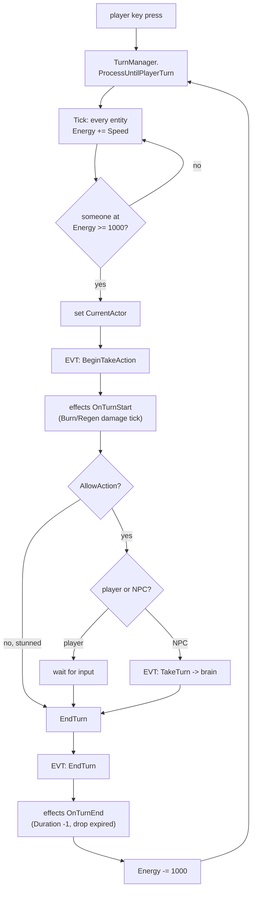
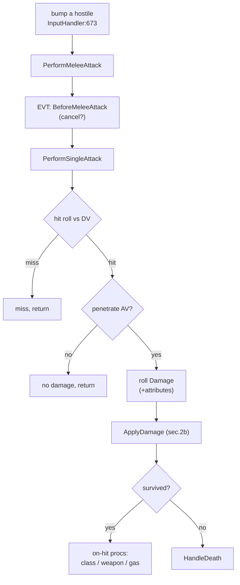
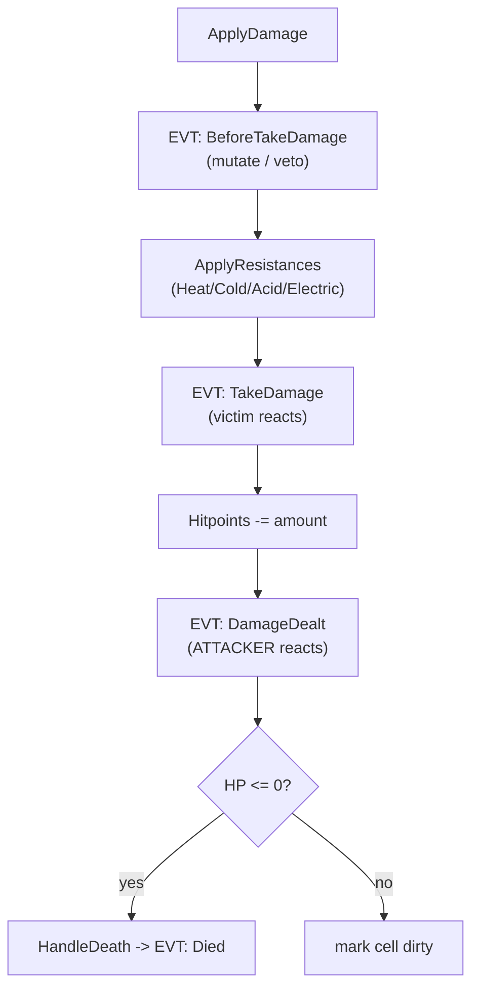
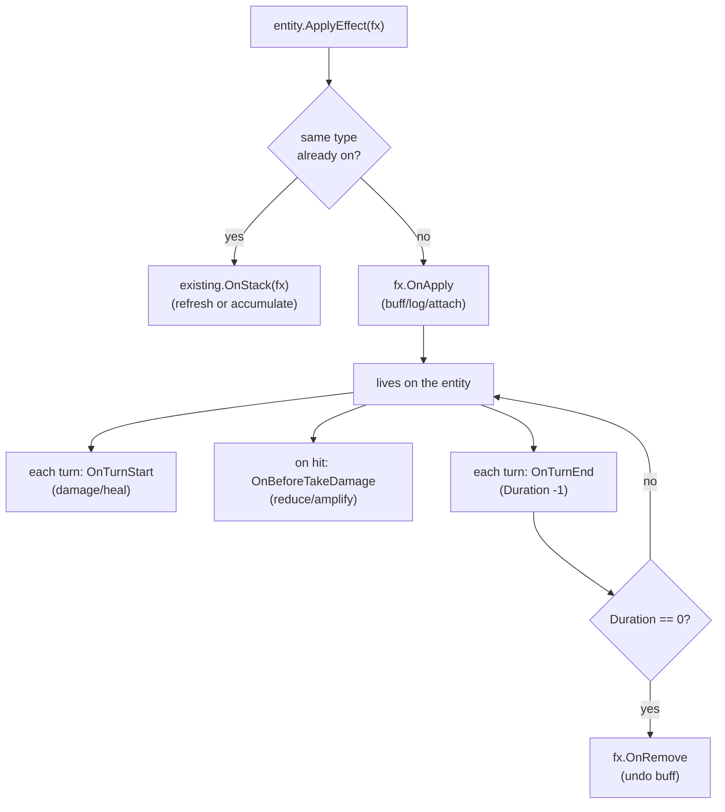
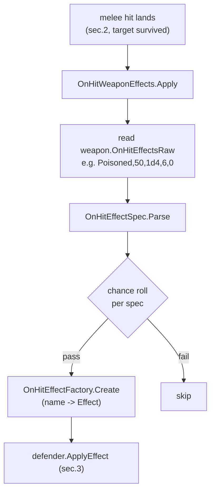
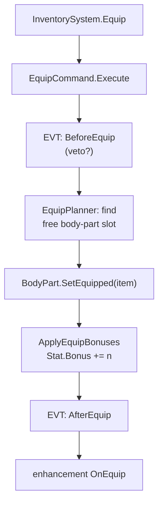
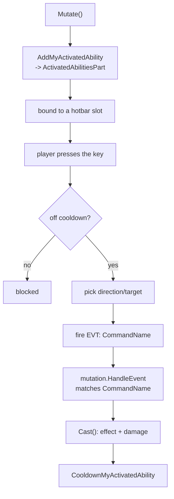
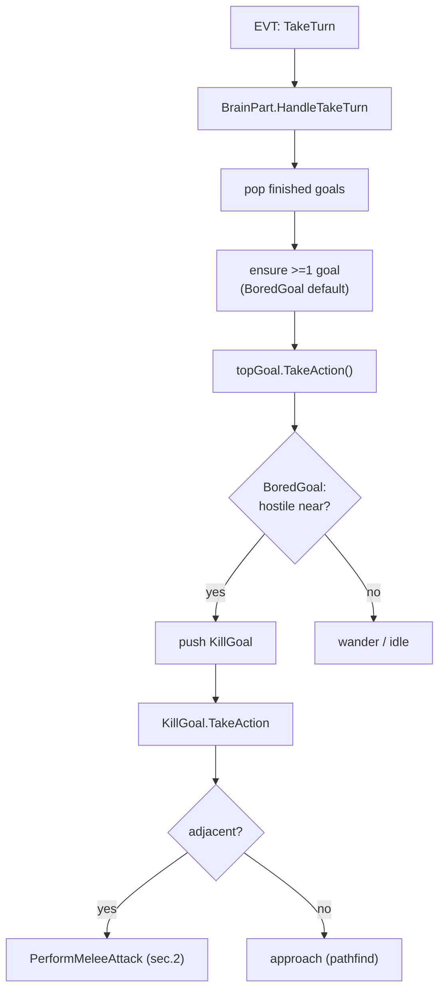
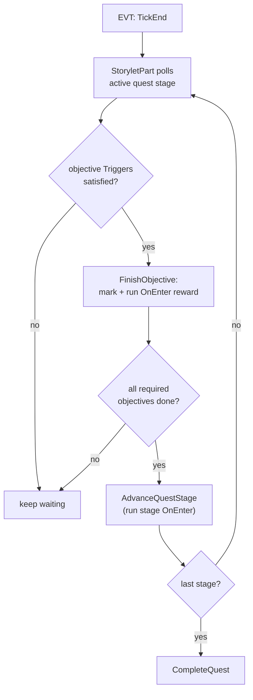

# Control Flow — mobile field guide

> **Reading this on an iPhone:** every diagram is **vertical** (top-to-bottom), so
> it fits a phone column — open on GitHub (web or the mobile app) and tap a
> diagram to zoom. Under each diagram is a numbered list saying the same thing in
> words, so you never *need* the picture. Wide tables are avoided on purpose.
>
> Companion: [DATA-FLOW-MOBILE.md](DATA-FLOW-MOBILE.md) (how the *data* moves) ·
> [COMBAT-FLOW-TRACE.md](COMBAT-FLOW-TRACE.md) (the attack flow in full detail).

---

## The one idea: everything is an event relay

Systems don't call each other directly. A system fires a **string-keyed event**
on an entity; `Entity.FireEvent` ([Entity.cs:255](Assets/Scripts/Gameplay/Entities/Entity.cs:255))
loops **every Part** and calls `HandleEvent`; the Parts that care
(`if (e.ID == "...")`) react — and may fire more events.

**Why ⌘B (go-to-definition) fails you:** there is no static link across
`FireEvent`. To find who reacts to an event, **⌘⇧F the event string** (e.g.
`"DamageDealt"`). That search result *is* the control flow.

---

## Contents

1. [Turn loop (the heartbeat)](#1-turn-loop)
2. [Melee attack](#2-melee-attack)
3. [Status-effect lifecycle](#3-status-effect-lifecycle)
4. [On-hit proc pipeline](#4-on-hit-proc)
5. [Equip / unequip](#5-equip--unequip)
6. [Mutation active ability](#6-mutation-active-ability)
7. [AI brain / goals](#7-ai-brain--goals)
8. [Quest objective](#8-quest-objective)
9. [Challenge → flow index](#challenge--flow-index)

---

## 1. Turn loop

*The clock everything hangs off. Energy-based: faster actors act more often.*

1. Input → `TurnManager.ProcessUntilPlayerTurn` ([TurnManager.cs:212](Assets/Scripts/Gameplay/Turns/TurnManager.cs:212)).
2. `Tick` grants `Energy += Speed` to every entity until one reaches 1000.
3. That entity becomes `CurrentActor`.
4. **EVT `BeginTakeAction`** → `StatusEffectsPart.HandleBeginTakeAction` ([StatusEffectsPart.cs:398](Assets/Scripts/Gameplay/Effects/StatusEffectsPart.cs:398)) runs every effect's `OnTurnStart` — **this is where Burning/Regen deal their per-turn HP change**, and where `AllowAction` can block a stunned actor.
5. Player → waits for input. NPC → **EVT `TakeTurn`** drives the brain (§7).
6. `EndTurn` → **EVT `EndTurn`** → `HandleEndTurn` runs `OnTurnEnd` (Duration−1; drop effects at 0).
7. Spend 1000 energy; loop.

**Challenges here:** #10 Regeneration & #13 Corrosion (tick in step 4), #12 Haste/Slow (changes **Speed** → step 2 → turn order), #19 mutation cooldowns (tick in step 6).

---

## 2. Melee attack

*Full cited version in [COMBAT-FLOW-TRACE.md](COMBAT-FLOW-TRACE.md). Compact map:*

**2b — inside `ApplyDamage`** ([CombatSystem.cs:715](Assets/Scripts/Gameplay/Combat/CombatSystem.cs:715)):

**Challenges here:** #2 Lifesteal & #8 Crit trait (EVT `DamageDealt`), #4 Marked & #5 Wet+shock (EVT `BeforeTakeDamage`/resistances), #9 Thorns (EVT `TakeDamage`), #1/#6/#7 procs (on-hit stage), #23 reputation (EVT `Died`).

---

## 3. Status-effect lifecycle

*An `Effect` is a small object living on an entity's `StatusEffectsPart`.*

1. `ApplyEffect` ([StatusEffectsPart.cs:38](Assets/Scripts/Gameplay/Effects/StatusEffectsPart.cs:38)): if a same-type effect exists, call its `OnStack` (and usually *don't* add a duplicate); else `OnApply`.
2. While alive it gets `OnTurnStart`/`OnTurnEnd` from the turn loop (§1) and `OnBeforeTakeDamage` from combat (§2b).
3. `OnTurnEnd` decrements `Duration`; at 0 → `OnRemove` (undo whatever `OnApply` did — **symmetry**).

Base contract: [Effect.cs](Assets/Scripts/Gameplay/Effects/Effect.cs). Model to copy: [BerserkEffect.cs](Assets/Scripts/Gameplay/Effects/Concrete/BerserkEffect.cs).

**Challenges here:** #3 Weakened, #4 Marked, #5 Wet+shock, #10 Regeneration, #11 Glow, #12 Haste/Slow, #13 Corrosion (`OnStack`), #17 cursed-item effect.

---

## 4. On-hit proc

*How a weapon's data string becomes a live effect on the victim.*

1. After a surviving hit, `OnHitWeaponEffects.Apply` ([CombatSystem.cs:437](Assets/Scripts/Gameplay/Combat/CombatSystem.cs:437)) reads the weapon's `OnHitEffectsRaw`.
2. `OnHitEffectSpec.Parse` splits the string; each spec rolls its own chance.
3. `OnHitEffectFactory.Create` ([OnHitEffectFactory.cs](Assets/Scripts/Gameplay/Items/OnHitEffectFactory.cs)) maps the name → an `Effect`, applied to the defender (→ §3).

**Challenges here:** #1 VenomDagger (data only), #6 new proc (add a factory `case`), #7 gas-on-hit (parallel `OnHitGasEmit`).

---

## 5. Equip / unequip

- Equip: `EquipCommand.Execute` ([EquipCommand.cs:69](Assets/Scripts/Gameplay/Inventory/Commands/EquipCommand.cs:69)) → `BeforeEquip` → slot resolve → `SetEquipped` → `ApplyEquipBonuses` ([EquipBonusUtility.cs](Assets/Scripts/Gameplay/Items/EquipBonusUtility.cs), format `"Strength:2"`) → `AfterEquip`.
- Unequip mirrors it: `BeforeUnequip` → **remove** bonuses → clear slot → `AfterUnequip`.

**Challenges here:** #14 stat ring (`EquipBonuses`), #17 cursed item (listen `AfterEquip`/`AfterUnequip`).

---

## 6. Mutation active ability

1. `Mutate` registers the ability via `AddMyActivatedAbility` ([BaseMutation.cs:210](Assets/Scripts/Gameplay/Mutations/BaseMutation.cs:210)) → `ActivatedAbilitiesPart`, bound to a hotbar slot.
2. Key press → cooldown check → direction → fires an event named after the ability's `CommandName`.
3. The mutation's `HandleEvent` matches that name → `Cast()` → applies effect/damage → sets cooldown (which ticks down in §1 step 6).

Models: [KindleMutation.cs](Assets/Scripts/Gameplay/Mutations/KindleMutation.cs) (projectile), [CalmMutation.cs](Assets/Scripts/Gameplay/Mutations/CalmMutation.cs) (targeted).

**Challenges here:** #18 passive mutation (just `Mutate`/`Unmutate` + a stat), #19 active ability (the whole chain).

---

## 7. AI brain / goals

*NPCs run on a stack of goals. Same `CombatSystem` entry as the player.*

1. **EVT `TakeTurn`** → `BrainPart.HandleTakeTurn` ([BrainPart.cs:592](Assets/Scripts/Gameplay/AI/BrainPart.cs:592)).
2. Pop finished goals; ensure a default (`BoredGoal`); run the top goal's `TakeAction` ([GoalHandler.cs:26](Assets/Scripts/Gameplay/AI/Goals/GoalHandler.cs:26)).
3. `BoredGoal` scans for hostiles → pushes `KillGoal`; `KillGoal` attacks if adjacent (→ §2) else approaches. A pushed child runs the same tick.

**Challenges here:** #22 new AI goal (add a `GoalHandler` subclass, push it from a brain).

---

## 8. Quest objective

1. On `TickEnd`, `StoryletPart` ([StoryletPart.cs:509](Assets/Scripts/Gameplay/Storylets/StoryletPart.cs:509)) checks each active objective's `Triggers`.
2. Satisfied → `FinishObjective` ([StoryletPart.cs:338](Assets/Scripts/Gameplay/Storylets/StoryletPart.cs:338)): mark done + run `OnEnter` rewards.
3. All required objectives done → `AdvanceQuestStage` → next stage's `OnEnter`, or `CompleteQuest`.
4. World shortcut: items with `CompleteObjectiveOnTaken` / `QuestStarter` fire off the **`Taken`** event on pickup.

**Challenges here:** #20 collect-N quest (author the data), #21 quest-start item (`QuestStarter` on `Taken`).

---

## Challenge → flow index

- **#1 VenomDagger** → §4 on-hit + content (data-flow doc)
- **#2 Lifesteal** → §2 `DamageDealt`
- **#3 Weakened** → §3 effects + §4
- **#4 Marked** → §3 + §2 `BeforeTakeDamage`
- **#5 Wet+shock** → §3 + §2 resistances
- **#6 New proc** → §3 + §4
- **#7 Gas weapon** → §4 + content
- **#8 Crit trait** → §2 `DamageDealt`
- **#9 Thorns** → §2 `TakeDamage`
- **#10 Regeneration** → §3 + §1 (tick)
- **#11 Glow** → §3 (render only)
- **#12 Haste/Slow** → §3 + §1 (Speed → order)
- **#13 Corrosion** → §3 (`OnStack`) + §1
- **#14 Stat ring** → §5 (`EquipBonuses`)
- **#15 Flammable** → content + thermal (data-flow doc)
- **#16 Readable book** → the event relay (inventory-action events)
- **#17 Cursed item** → §5 + §3
- **#18 Passive mutation** → §6 (`Mutate`)
- **#19 Active ability** → §6 (full) + §1 (cooldown)
- **#20 Collect-N quest** → §8
- **#21 Quest item** → §8 (`Taken`)
- **#22 AI goal** → §7
- **#23 Rep creature** → §2 `Died`

---

## Explore it live (Rider + Unity)

- Breakpoint [Entity.cs:255](Assets/Scripts/Gameplay/Entities/Entity.cs:255) (`FireEvent`), condition `e.ID == "DamageDealt"` → watch one junction.
- Breakpoint [CombatSystem.cs:386](Assets/Scripts/Gameplay/Combat/CombatSystem.cs:386), **Step Into (F7)** to walk §2b.
- Attach: **Run → Attach to Unity Process**, then act in-game.
- No debugger? **⌘⇧F** an event string to list its fire site + every handler.
