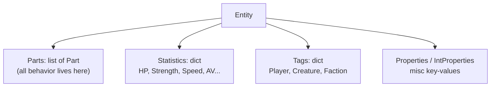
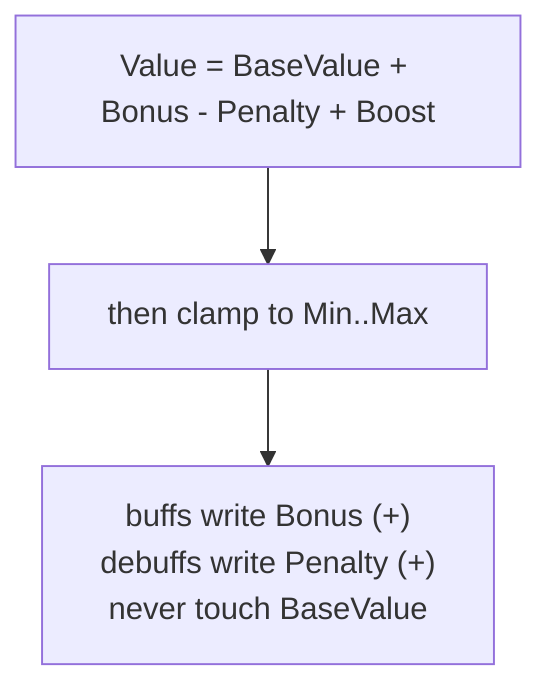
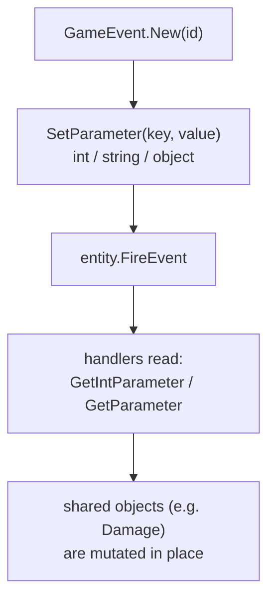
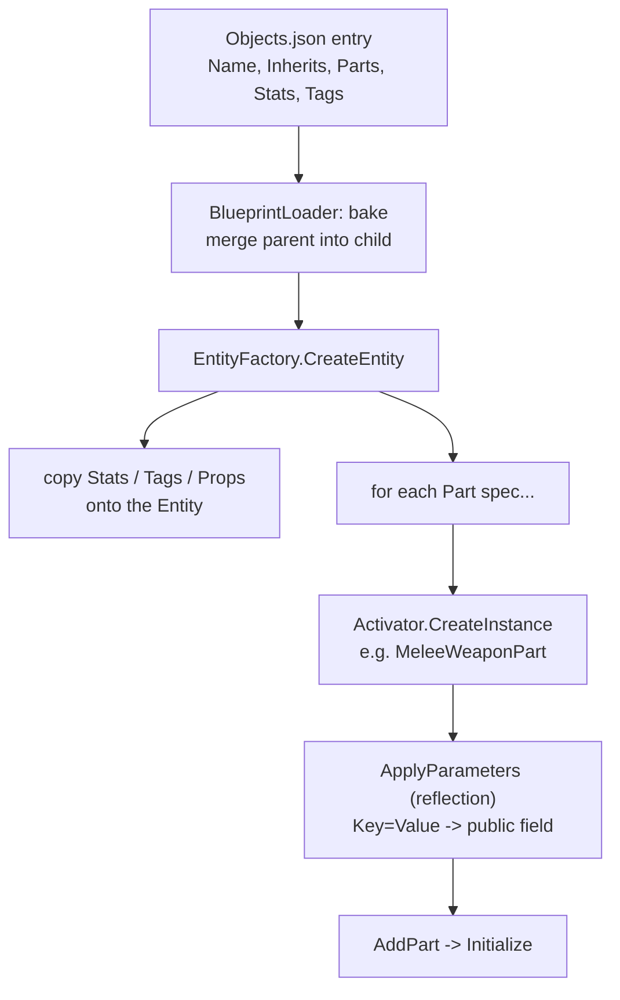
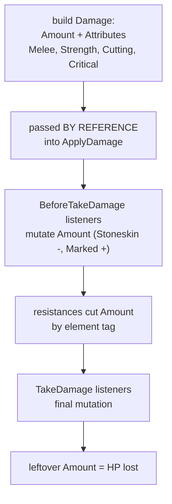
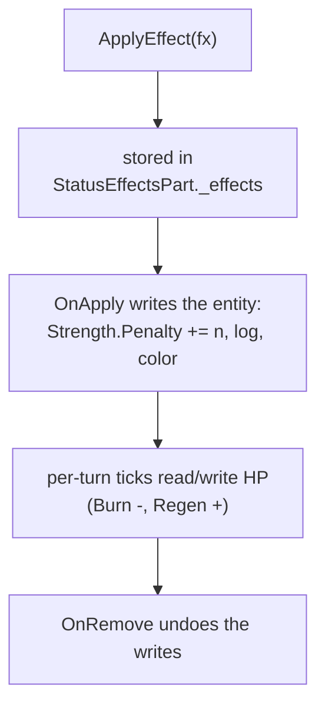
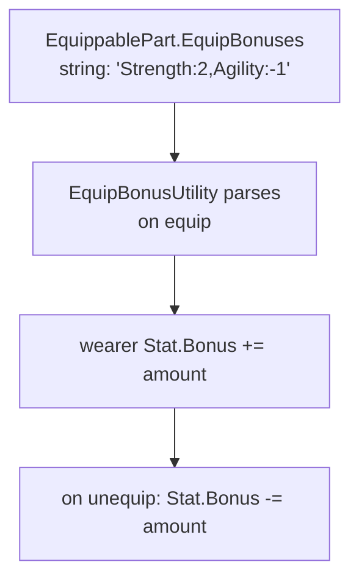

# Data Flow — mobile field guide

> **On an iPhone:** diagrams are vertical (fit a phone column); open on GitHub and
> tap to zoom; the numbered list under each says the same thing in words.
>
> Control-flow companion: [CONTROL-FLOW-MOBILE.md](CONTROL-FLOW-MOBILE.md) (the
> *order* things run). This doc is about the *shapes of the data* and how each
> transforms as it moves.

---

## Contents

1. [What an Entity is made of](#1-the-entity)
2. [Stats: how a number is computed](#2-stats)
3. [GameEvent: the data envelope](#3-gameevent)
4. [Blueprint → Entity (content becomes a thing)](#4-blueprint--entity)
5. [The Damage object's journey](#5-the-damage-object)
6. [An Effect's data on an entity](#6-effect-data)
7. [EquipBonuses → your stats](#7-equipbonuses)
8. [Who owns / mutates each data type](#8-ownership)
9. [Challenge → data touched](#challenge--data-touched)

---

## 1. The Entity

Everything in the world — player, snapjaw, dagger, corpse — is one `Entity`. It
holds no logic itself; it's a **bag of data + Parts**.

- **Parts** = behavior (a `MeleeWeaponPart`, a `LifestealPart`, a `Body`). Reacting to events happens here.
- **Statistics** = named numbers (`GetStatValue("Hitpoints")`).
- **Tags** = boolean-ish flags (`HasTag("Player")`).
- **Properties** = loose extra data.

[Entity.cs](Assets/Scripts/Gameplay/Entities/Entity.cs)

---

## 2. Stats

A `Stat` isn't a single number — it's computed, so buffs/debuffs are reversible.

- Damage lowers `BaseValue` of `Hitpoints` (permanent until healed).
- A Strength buff does `Strength.Bonus += 5`; removing it does `-= 5`. `BaseValue` is untouched, so it always restores cleanly.
- This is *why* effects can stack and unwind without corrupting the stat.

[Stat.cs](Assets/Scripts/Gameplay/Stats/Stat.cs)

---

## 3. GameEvent

The envelope data rides between Parts. Carries an `id` plus a parameter bag.

- Simple values (e.g. `"Amount" = 10`) are read back by handlers.
- **The powerful trick:** an event can carry a *reference* to a mutable object (the `Damage`). Handlers change that object, and the change is seen by everything downstream. That's how Stoneskin lowers damage mid-flight.

[GameEvent.cs](Assets/Scripts/Gameplay/Events/GameEvent.cs)

---

## 4. Blueprint → Entity

How a JSON definition becomes a live, Part-equipped object.

1. `Inherits` is resolved by merging the parent blueprint's parts/stats into the child ([BlueprintLoader.cs](Assets/Scripts/Data/Blueprints/BlueprintLoader.cs)).
2. `CreateEntity` ([EntityFactory.cs:157](Assets/Scripts/Data/Factories/EntityFactory.cs:157)) copies stats/tags, then for each Part: makes the instance and **reflects each `Key=Value` onto a public field** of that Part. No wiring code — `"BaseDamage":"1d4"` just sets `MeleeWeaponPart.BaseDamage`.
3. This is why Challenge #1 needed **zero C#**: you added data; reflection did the rest.

**Challenges here:** #1 VenomDagger, #7 gas weapon, #14 stat ring, #15 flammable item (all "add a blueprint" data).

---

## 5. The Damage object

Damage is **one mutable object** that travels the pipeline and is whittled down.
The final HP loss is whatever's left — *not* the dice you rolled.

- **Attributes** are tags on the damage (`"Heat"`, `"Critical"`). Resistances and on-hit reactions read them — e.g. `HeatResistance` only applies if the damage has a heat tag; your crit trait checks for `"Critical"`.
- Because it's by-reference, every junction in §2b of the control-flow doc can change it. The honest "damage dealt" is measured as `hpBefore − hpAfter`.

[Damage.cs](Assets/Scripts/Gameplay/Combat/Damage.cs) · [CombatSystem.cs:715](Assets/Scripts/Gameplay/Combat/CombatSystem.cs:715)

**Challenges here:** #4 Marked & #5 Wet+shock (mutate Amount), #8 crit trait (read Attributes).

---

## 6. Effect data

An `Effect` is a small data object that *lives on* the target and reads/writes
its stats over time.

- The effect carries its own data (`Duration`, a magnitude, a saved penalty amount).
- It mutates the host's `Stat`s / `Hitpoints` and must reverse exactly what it did on remove (the apply/remove **symmetry**).

[StatusEffectsPart.cs](Assets/Scripts/Gameplay/Effects/StatusEffectsPart.cs) · [Effect.cs](Assets/Scripts/Gameplay/Effects/Effect.cs)

**Challenges here:** every effect challenge — #3, #4, #5, #10, #11, #12, #13, #17.

---

## 7. EquipBonuses

A string on the item turns into stat bonuses on the wearer.

- Pure data on the item → reflected math on the wearer's stats. Same `Bonus` field a buff effect uses (§2), so a ring and a Haste spell add cleanly together.

[EquipBonusUtility.cs](Assets/Scripts/Gameplay/Items/EquipBonusUtility.cs)

**Challenges here:** #14 stat ring.

---

## 8. Ownership

Who holds each data type, and who is allowed to change it:

- **Hitpoints `BaseValue`** — lowered only by `CombatSystem.ApplyDamage`; raised by heals (your Lifesteal). Clamp to `Max`.
- **Stat `Bonus` / `Penalty`** — written by effects (`OnApply`/`OnRemove`) and `EquipBonuses`. Always paired (add ⇄ remove).
- **`Damage.Amount` / `Attributes`** — built in `PerformSingleAttack`, mutated only inside the `ApplyDamage` pipeline.
- **`GameEvent` params** — set by the firer; read (and shared objects mutated) by handlers; the event is pooled/released after.
- **Parts list** — built by `EntityFactory` from the blueprint; rarely changed at runtime (mutations add/remove body parts).
- **Effects list** — owned by `StatusEffectsPart`; added by `ApplyEffect`, dropped when `Duration` hits 0.

---

## Challenge → data touched

- **#1, #7, #14, #15** → Blueprint→Entity (§4); reflected Part fields.
- **#2, #9** → `Hitpoints.BaseValue` via the `DamageDealt`/`TakeDamage` envelope (§3, §5).
- **#3, #12** → `Stat.Bonus/Penalty` (§2) carried by an Effect (§6).
- **#4, #5** → mutate the `Damage` object in-flight (§5).
- **#8** → read `Damage.Attributes` (§5).
- **#10, #13** → write `Hitpoints`/AV over time from an Effect (§6).
- **#11** → effect render color (data read by the renderer).
- **#17** → effect data attached via equip events (§6 + §7).
- **#14** → `EquipBonuses` string → `Stat.Bonus` (§7).
- **#18, #19** → mutation writes stats / ability data (`ActivatedAbilitiesPart`).
- **#20, #21** → `QuestState` (CurrentStageIndex, FinishedObjectives).
- **#23** → `PlayerReputation` ledger via the `Died` envelope.

---

*See the control-flow doc for the execution order, and
[COMBAT-FLOW-TRACE.md](COMBAT-FLOW-TRACE.md) for the attack pipeline in full.*
