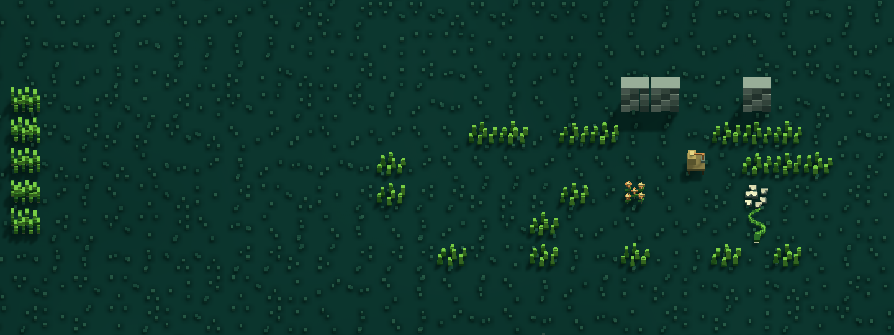
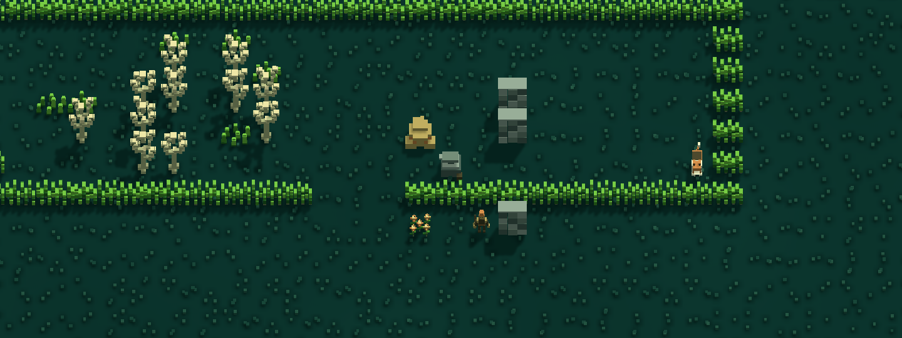

# Spread content expansion: gathering, preparation and work sites

Status: complete and verified for publication to main. Starting from dbe93a4d7. Original CoO content; no Qud mechanics-parity claim.

## Player outcome and ordered plan

1. Use existing lasting charm-flowers in opted-in meadow landscapes, retaining temporary conjured FlowerField owners in legacy and spell paths.
2. Add two visibly distinct, finite native gathering sources: StoneburrPatch yields StoneburrSeed for Stoneskin; FrostLichenPatch yields FrostLichen for a Frozen quench medium. Each source yields 1–2 units once, then disappears. Use existing harvest, brewing, drinking and tempering authority.
3. Add three small original places in ordinary new-world Spread: FieldAlembic (still and gathering), TemperingShelter (forge and protective-seed gathering), TrappersStore (actual existing container, cold gathering, spike trap and an open bypass). Real geometry and restrained examine text explain the opportunities. No quest prerequisite.
4. Add two original ranged-role Marlbacks, Cindercaller and Soursprayer. At the latter two sites, replace only an exact ordinary two-hostile roll with the caster and one melee Scrabbler. Single-hostile rolls remain ordinary; never add a second group. Actual finite loadouts supply rewards. Existing supported EmberSpit/AcidSpray targeting and ally assistance remain authoritative; no new kiting/bow behavior is claimed.
5. Give new plants distinct 3D source models; differentiate new ranged identities and check actual rendered scenes. Run meaningful RED→GREEN tests, counter-checks, source/state adversarial checks, native visual/action verification and update this doc in the same commits. Fetch/rebase before publishing to main.

Implementation directive: deliver the above player actions and readable places using the current entity/parts, generation and renderer paths. New exploration version 9 will retain literal saved v2–v8 selections and cached graphs. Keep protected/named/rare/quest areas, original starter glade, safe arrivals and exits intact. Preserve BitLocker as dev-only. Reuse the existing test/native capture infrastructure; do not build a general encounter framework. Significant gameplay failures block the affected slice; minor unrelated problems are noted and deferred.

## Verification sweep / corrections

| Assumption | Verified contract and decision |
|---|---|
| Permanent flowers need a new blueprint | Objects.json already has CharmFlowers with vegetation and no FlowerCharm/Lifespan. SpreadVoxelLibrary and SpreadEnvironmentRecipes already supply its 3D form. Use it only in the new landscape branch. |
| Brewing requires a still | BrewReagentsCommand permits a single brew anywhere; a still is required only for non-food batches. The abandoned still offers batch convenience. |
| Drinking frost coating helps the player | Frost output inherits Drink=true and would freeze the drinker. Useful weapon route is Quench beside a TinkersForge; existing examine text already explains this. Site text must reinforce it. |
| Harvested plants become spent models | Harvestable removes its owner after committed harvest. Underlying terrain remains; no false live/depleted owner state is introduced. |
| New mixed IDs can be rewritten into PopulationBuilder rolls | Existing source receipts identify original Viper/Scrabbler group rows. Use the existing late atomic substitution pattern, not a generic population rewrite. |
| A selected site proves it was placed | Exact finite sources and safe geometry can refuse. Record actual realizations and preserve ordinary owners on refusal. |
| Every ranged skill has AI | CombatTactics supports EmberSpit, IceLance and AcidSpray; bow/kiting behavior is not supplied. Use existing supported attacks with restrained kits. |

References checked: SpreadCompositionPlan/Builder, PopulationTable/Builder, SpreadExplorationPlan/Builder/Hunt, HarvestablePart, BrewReagentsCommand, TemperWeaponCommand, CombatTacticsPart, Objects.json and existing environment source/model recipes. Detailed source corrections and evidence are added with each completed slice.

## Budgets, presentation and persistence

Finite new resource stock is explicitly authorized content, separate from existing forage receipts. Mixed enemies consume at most the original two-owner hostile allowance; no death, XP or original-owner loot is generated by replacement. The storehouse reuses actual container stock, with no second roll. Inaccessible/missing/changed owners must refuse or reject the cold generation cleanly.

Existing cached zones remain literal saved graphs. Older selected exploration versions retain their family assignment and are not silently upgraded. New3D art uses the approved palette and source/import path, with no added simulation components. All new C# files under Assets receive handwritten fresh-guid metadata.

## Performance

Bounded cold-generation layout search and existing geometry/receipt validation. No new per-frame actor search or permanent world cache. Reuse current supported tactics rather than add a new per-turn AI loop; native plant removal uses existing dirty-cell hooks. Model additions extend the existing environment library and its real contact capacity only as needed.

## Evidence, self-review and honesty bounds

Acceptance separates generated previews, native EditMode behavior, and actual-input Play witnesses. A configured family, a screenshot or a private helper passing does not prove ordinary discovery, balance over many seeds, or a complete live action path. Cached old chunks will not acquire these sites through reload.

## Implemented content and directions

Fresh version-nine worlds assign a field alembic to **Overworld.11.9.0 (north of the glade)**, a tempering shelter to **Overworld.12.10.0 (east)**, and a trapper’s store to **Overworld.11.11.0 (south)** when those addresses remain ordinary eligible Spread. These three sites committed in actual native generation for seeds 64 and 1729. Existing cached chunks and saved earlier-version assignments are retained; this is new-world content rather than a retrofit.

The alembic has a functioning still, stoneburr and frost lichen. The forge shelter has a functioning forge and stoneburr. The store moves one original unlocked Crate/Sack with its exact contents, places frost lichen and a visible native spike trap, and preserves a bypass. Small broken walls identify the sites. Examine text explains useful actions without map icons or quest requirements. Gathered patches yield 1–2 existing ingredients once and disappear; floor owners remain. Natural landscape charm-flowers have no lifespan; legacy/conjured FlowerField retains its existing wilting behavior.

Cindercallers spit embers; soursprayers use acid spray. Both have 12 HP, sight 6, an existing eight/ten-turn skill cooldown, a 35% eligible-ability chance, and a real cudgel plus one FireMoss/GlimmerBrine respectively. Existing melee and line-of-fire behavior remains authoritative. Each optional mixed encounter replaces an exact two-hostile roll with the caster and a cooperating Scrabbler; a single-hostile roll remains single. Native generated mixed witnesses: seed 64 **Overworld.15.10.0**, cindercaller at (22,10); **Overworld.10.1.0**, soursprayer at (66,16).

Eight original cuboid plant forms (four each) and two distinct existing-rig caster bodies were imported. All 597 borrowed model, palette and animation files remained byte-identical; the environment library now has 48 forms and the humanoid library 54. The new actors use the existing five animation clips and real held equipment; no new animation behavior is claimed.

## Distribution correction and self-review

🟡 **Resolved: new content displaced earlier variety.** The first broad allocation replaced 60% of eligible meadow/fallow families and the native regression corpus lost seed-1729 hunt/work-gang opportunities. The final distribution uses only previously quiet rolls 22–34 for broader sites, alongside the three deliberate nearby examples. Other quiet addresses remain quiet. Original active encounter families retain their selection elsewhere. Cardinal same-family exclusion and protected areas still apply.

🟡 **Resolved: misleading station requirement.** An initial site description incorrectly required a still for a single brew. Final text states field brewing is allowed and stills support batches. Frost coating text warns that drinking freezes the drinker and explains the forge route.

🧪 **Bounds:** geometric safety covers initial arrival, reachable interactions and exits; later moving enemies can make a route dangerous. Optional placement can refuse when original container/actor stock or useful geometry is unavailable. The two caster witnesses prove occurrence, not frequency or long-term balance. The standalone hashing runner was used only for auxiliary authoring checks; reported final gameplay counts come from native Unity.

Cold-eye Q1–Q4: state source replacement is symmetric with rollback and preserved detached owners; no death/XP/duplicate stock is generated. Native positive and refusal controls exercise both pairing and retention. Literal v8 manifests round-trip and reject v9-only family IDs. Narrative descriptions now match the actual brewing/tempering commands. Actual caster occurrence is checked independently from selected family names.

## Test log and evidence

- Native RED: 48 cases, 22 intended failures (18 missing-site/selection cases, four lasting-flower cases), 26 controls passing.
- After gameplay integration: 78 cases, 69 pass; remaining nine failures identify missing plant/caster art and the scoped importer. These were observed before adopting the art changes.
- Initial broader regression: 1,050 cases, 990 pass, 60 fail. Failures separated into intentional version/roster/flower pins and the real distribution regression above. Historical literal-version cases were retained.
- Imported-model/nearby/action sweep: 137 cases, 133 pass. Four persistence failures exposed a fixture using a disabled legacy manager with a manufactured zone; the corrected cases use actual accepted, generated north-alembic owners. The other gathering, combat, six nearby commitments and both generated caster witnesses passed.
- Native source import: all ten new mesh/prefab pairs and metadata exist; old 597 files unchanged. Original 40 environment source rows, 52 actor source rows and both palettes remain identical.
- Final regression, actual-input Play results and reviewed screenshots are recorded below when completed.

## Files and implementation boundary

Content: four surgical Objects.json additions; no prior parsed blueprint changes. Terrain: SpreadCompositionPlan natural flowers. Generation: SpreadExplorationPlan v9, SpreadExplorationBuilder dispatch, and one scoped SpreadExplorationWorksites helper. Art: existing environment/humanoid source/import/library/recipe paths with ten model additions. Tests: new worksite, manifest, specialist gathering/combat and plant/caster art fixtures; exact current-version/roster pins updated in existing coverage. Verification: existing native glade driver gains a specialist route; existing landscape preview gains site views. No new global gameplay framework, tinkering enablement, enemy migration or unrelated system change.

### Bounded native walkthrough corrections

The first two isolated attempts refused their source approaches. The driver originally demanded no hostile within eight cells of every worksite action; occupied sites intentionally retain nearby actors. Source logging confirmed the actual v9 alembic committed. The final driver retains the existing clearance-two initial travel policy and physical/hazard checks for local interactions, while permitting ordinary nearby danger; it does not remove or calm enemies. Shortcuts remain explicitly reported.

The third attempt completed harvesting, brewing, drinking and tempering, but its three station assertions expected paid turns. Source inspection confirmed the existing AlchemyStillPart/ForgePart commands consume ingredients without advancing the scheduler. The final witness checks those existing clocks as well as exact consumption/output and original weapon identity. This is a driver correction, not a gameplay timing change. **Deferred balance question:** whether station crafting should spend turns. It is not needed to make the new finite stock usable, and changing all crafting timing would exceed this content batch.

## Final acceptance

- **Unity 6000.3.4f1 EditMode: 1,148/1,148 pass**, zero failures/skips, 177.55 seconds. [Full native results](Verification/SpreadSpecialistContent/Evidence/native-final-tests.json). This is the affected exploration/rendering/combat/content selection, not the whole project suite.
- **Actual-input Play: 10/10 checks, zero unexpected errors**, 13.79 seconds. [Final native report](Verification/SpreadSpecialistContent/Native/2c01681072e642ee877ac5f55365c5e9/report.json). Actual generated alembic: north11.9; actual forge selected by that live route:10.9. Two disclosed actor travel shortcuts reach the sources; local movement and menus use keyboard input, ordinary owners and the live scheduler. Both finite harvests, single brews, Stoneskin drinking and frost quenching of the original dagger succeeded. No source grants, scripted damage, enemy suppression or forced success. Core tests separately establish freeze-on-hit and save/revisit persistence.
- **18 native preview frames, zero missing meshes**, covering five addresses × two seeds and eight site views. [Generation receipt](Verification/SpreadSpecialistContent/Views/receipt.json). Full reveal is for visual review only. Review confirms distinct ochre seedheads/pale low lichen, solid broken walls, and warm-cap/green-hood caster identities on current owners. Screenshots do not establish natural discovery, full-world frequency or long-term balance.
- **Source checks:** existing environment8/8 and humanoid6/6; new private authoring checks4/4 plants and3/3 casters. Native tests cover imported models, actual owner routing and harvested-view removal. [Imported assets](Verification/SpreadSpecialistContent/Evidence/casters-import.json), [borrowed-file comparison](Verification/SpreadSpecialistContent/Evidence/borrowed-models.json), [surgical blueprint proof](Verification/SpreadSpecialistContent/Evidence/blueprint-diff.json).

Reproduce the actual-input route from **Caves Of Ooo → Scenarios → World → Spread Specialist Content Audit** in idle Unity with saved scenes. It uses the existing isolated-save launcher and restores the prior editor scene/setup. Failed precondition and station-clock receipts are retained separately, not presented as passing gameplay proof.

Final visual cold-eye review accepted all four reviewed site closeups: distinct plants and specialist silhouettes, visible wall volume, no obvious holes or flat glyph fallback. Casting motion and long-distance readability remain playtest judgments. Unity-generated YAML retains its canonical empty-scalar spacing; source-only whitespace checks pass.
