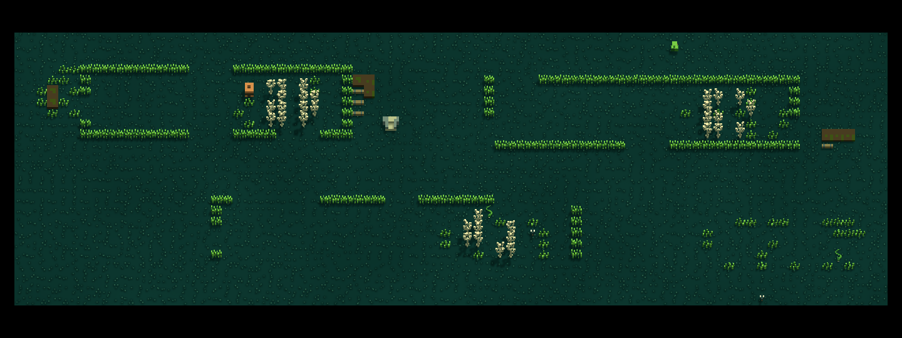
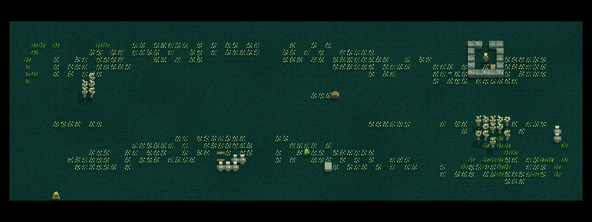
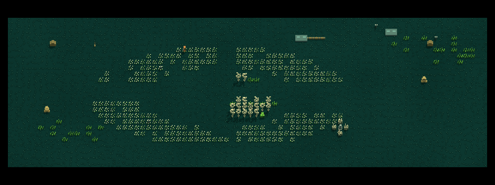

# Spread landscape variety

Status: implemented and verified in Unity. Follows `6dc1973a5`.

## Suggestions and implementation plan

1. Make ordinary wilderness visibly different beyond spawn. Add overgrown crofts, flower avenues, and a crescent meadow around a wooded hollow to the existing Spread composition plan. North `(11,9)`, east `(12,10)` and south `(11,11)` demonstrate the three profiles; other eligible Fallow/FlowerMeadow chunks select the same vocabulary with seed-dependent geometry.
2. Connect geography to existing play. Trees provide native cover and obstruction, broken hedges shape approaches, and flower margins leave room for the existing forage/wildlife systems. Keep existing population, forage, loot and situation allowances; do not add a new encounter framework or force a fight in quiet chunks.
3. Explain the landscape through physical shapes and local examine text. Reuse approved 3D trees, hedges, flowers and bushes; inspect actual native renders before adding models. Keep existing descriptions and append local terrain context, without quest arrows or promises of unplaced resources.

Implementation prompt: write failing geometry, realization and scope counters; change only opted-in Fallow/FlowerMeadow terrain generation; preserve border ports, dry approaches, native source ownership and legacy signatures. Run nearby composition, exploration and hunt regressions. Reuse existing native preview/walkthrough infrastructure to inspect north/east/south. Record useful failures, fix significant ones, and publish code, tests and this document together.

## Verification sweep and corrections

| Finding | Consequence |
|---|---|
| Ordinary Spread already has eleven exploration families, but three fixed parcel templates | Improve geography instead of inventing another mostly overlapping system |
| East and south are both FlowerMeadow; north is Fallow | Give the two meadows visibly different silhouettes and northern crofts a coherent hedge/tree structure |
| `ConnectOpenPockets` recognizes Hedge and Tree as blockers | Use those native owners; introduce no ruin-wall blocker that the repair pass cannot understand |
| Topology `Legacy` has frozen output pins | Leave legacy code paths unchanged; cached graphs remain literal saved state |
| Composition precedes population and exact source capture | New terrain is cold-built before existing situation placement; no live rearrangement or resource refill |
| FlowerField is a native temporary flower-charm owner, not a new food source | Retain its original behavior and text; only existing rolled berries/hives provide those resources |
| Previous starter change deliberately added a basin | Correct the older protected-site test's blanket no-basin assertion for that exact starter, retaining other controls |

FlowerField retains its native 200-turn charm lifespan in a clean zone (shorter under Urqu bleed); it is not permanent natural vegetation or new edible forage.

No external Qud contract is claimed. This is original CoO geography using existing mechanics. Existing cached chunks remain unchanged; opted-in, still-ungenerated wilderness chunks use the updated composition. Named sites, starter glade, legacy calls and other formations keep their existing terrain paths.

## Performance and acceptance

Generation-only bounded cell calculations and the existing reachability repair; no new per-frame scan, cache, AI, blueprint or asset pipeline. Bound tree/flower density and check connected approaches over several seeds. Use real Unity tests and native rendered images; do not treat a source-only shape check as visual acceptance. Keep verification proportional to this terrain change.

## Results and self-review

### Implementation

- `SpreadCompositionPlan`: scoped cold-generation profiles; long broken hedge boundaries and wooded work strips, three wavy flower bands, or a crescent around a wooded center. Seed-dependent details retain each neighboring direction’s identity. Existing dry border routes and pocket repair remain authoritative.
- `SpreadCompositionBuilder`: append local geometric context to native Tree/Hedge/FlowerField examine text before exact source receipts are captured. Existing verbs, source ownership and rewards remain native.
- `SpreadCompositionPreviewBatch.CaptureLandscapes(output)`: reuse the existing camera/presenter to capture six complete fresh native zones, two seeds, in disposable preview scenes. Reveal fog only for composition inspection. Restore borrowed content registries and rendering state; never access player saves.

### Verification log

1. Native RED: all 26 new cases failed against the previous production code, before implementation.
2. First implementation: 24/26 passed. Two flower-avenue seeds exceeded the proposed 360-flower density cap; reduced the fill threshold from 80% to 70%.
3. Native regression: 172/176 passed. Three failures revealed that dense croft regrowth prevented a real seed-64 occluded WorkGang from realizing. Added one-tile working cuts through the regrowth, with two wooded columns between them. These remain ordinary unreserved floor; no actor, loot or receipt guard was weakened. A fourth failure was the previous starter basin’s stale blanket no-basin pin, corrected to exactly one authored basin at `(36,9)` while preserving other protected-site exclusions.
4. Expanded the nine geometry cases across all three opted-in topology templates. All 51 targeted repair/landscape/exploration cases passed natively. Final wider regression: **199 passed / 0 failed / 0 skipped**, including the 26 new cases and existing composition/adversarial, exploration, encounter, collector, passage, hauling, cooking, hunt and starter fixtures. All 18 frozen legacy geometry pins remain green. This is a targeted native Unity sweep, not the entire project suite.

5. Inspected all six native whole-zone views for seeds 64/1729. Crofts show broken rectangular boundaries and working cuts; avenues show separated winding flower bands; the hollow shows a flower crescent and wooded middle. All use the shipped 3D renderer and real complete generation. No new model assets were necessary. The previews reveal fog and do not simulate a player.
6. Existing isolated native Play walkthrough: **17/17 passed, complete=true, 0 runtime errors, 36.48 seconds**. Real keyboard inputs exercised the starter basin, grain, cooking, hauling, save/load, hostile attrition and east-boundary exit/return. No healing tonic was needed. Northern and southern arrangements were verified by actual generated views and tests, not a live traversal. The harness restored the editor to `SampleScene`, idle and out of Play.

Evidence: [final Unity test receipt](Verification/SpreadLandscapeVariety/final-result.json), [native capture receipt](Verification/SpreadLandscapeVariety/Native/receipt.json), [raw live walkthrough receipt](Verification/SpreadLandscapeVariety/Play/report.json), [returned-game frame](Verification/SpreadLandscapeVariety/Play/07-returned-from-world.png). The raw live receipt retains its original local screenshot paths; the representative returned frame is preserved alongside it.

From the starting glade, cross one chunk north for the crofts, east for the avenues, or south for the hollow. These near-spawn identities are stable across seeds, while planting, openings and existing rolled situations vary. Other eligible Fallow/FlowerMeadow chunks use the same new vocabulary.

### In-phase self-review

- 🟡 Fixed: geometry must admit existing situations, not merely produce a distinct screenshot. The real WorkGang pipeline test caught the dense-tree failure; all three failed cases passed after the working cuts.
- 🔵 Corrected: starter basin was intentional previously shipped content, so its exact placement is now the protected-site assertion.
- ⚪ Deliberate: these profiles reuse existing models. The visible addition is larger-scale geography, not a new enemy or resource system. Existing population/forage/loot allowances remain unchanged, although terrain may alter which situations can safely realize.
- 🧪 Limits: native full-reveal images can establish shapes and model rendering, not natural discovery or combat feel. Broad world variety and subjective balance still benefit from player playtesting.

### Cold-eye pass

- Q1: all three profiles enter through the same bounds, approach, lawn and water guards; the legacy branch remains unchanged. Croft cuts are deliberately unreserved interior ground.
- Q2: native owners, their original actions and exact capture ordering are shared across all profiles. No alternative physics or rendering implementation was added.
- Q3: geometry covers three seeds, three directions and all three new topology templates; controls include legacy signatures, other formation families, no invented harvest/actors, nonempty-zone refusal, and actual current pipeline mutation/stock checks. The real WorkGang failure supplied a cross-feature counterexample and was fixed without relaxing its conditions.
- Q4: documented the existing temporary flower lifespan and old-save limits. Corrected the older native preview entry point to report its actual exploration topology rather than a reconstructed legacy plan.

### Honesty bounds

Can verify: native owner counts/parts, connected dry approach geometry, legacy signature counters, real generation, local examine text, and the actual rendered terrain in captured zones. The separate live walkthrough verifies native keyboard actions, persistence and east exit/return; its routes are scripted and do not prove natural discovery.

Cannot verify from stills or EditMode tests: whether repeated hours of exploration feel varied enough, the difficulty of every seed, or how each arrangement feels under normal fog while moving. Cached saved chunks are not regenerated; use a new game to see all three near-spawn landscapes reliably.

### Files

- `Assets/Scripts/Gameplay/World/Generation/SpreadCompositionPlan.cs`
- `Assets/Scripts/Gameplay/World/Generation/Builders/SpreadCompositionBuilder.cs`
- `Assets/Editor/Scenarios/SpreadCompositionPreviewBatch.cs`
- `Assets/Tests/EditMode/Gameplay/World/SpreadLandscapeVarietyTests.cs` and fresh `.meta`
- `Assets/Tests/EditMode/Gameplay/World/SpreadExplorationPipelineTests.cs`
- This document and selected native verification evidence.
