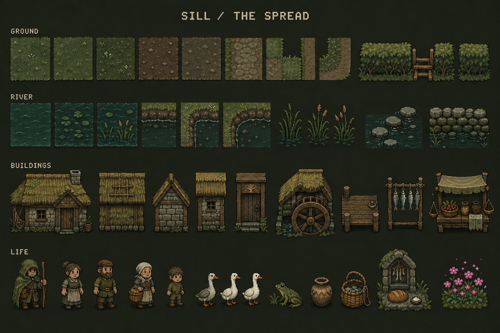
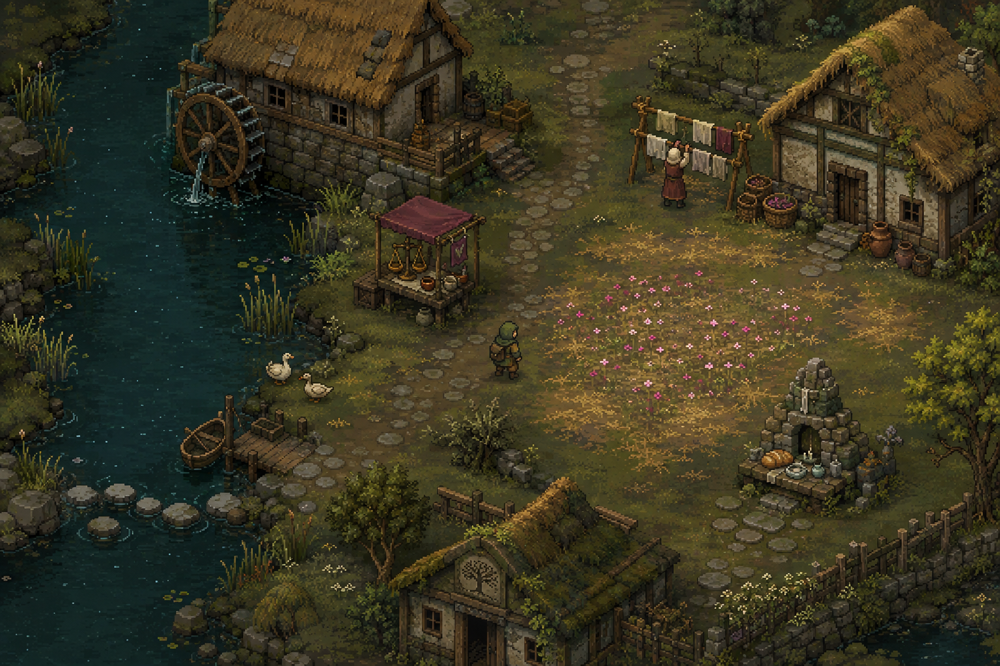
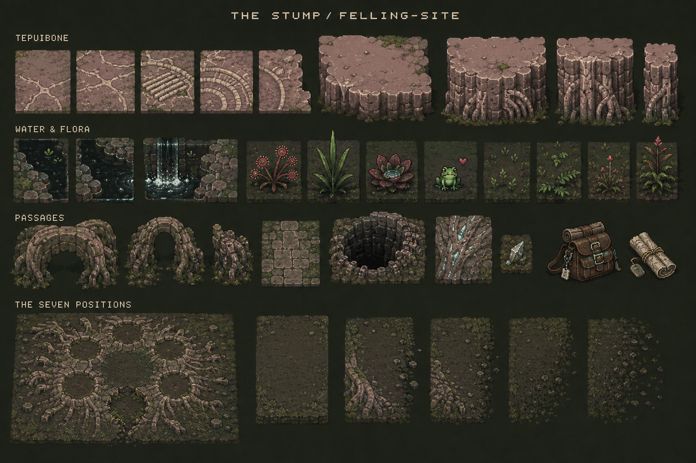
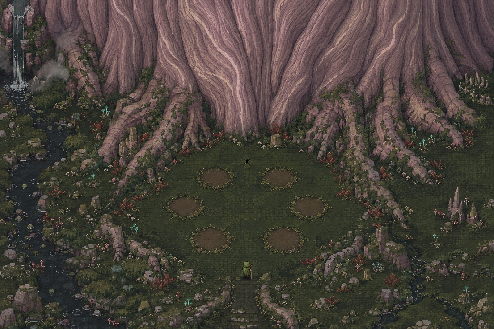
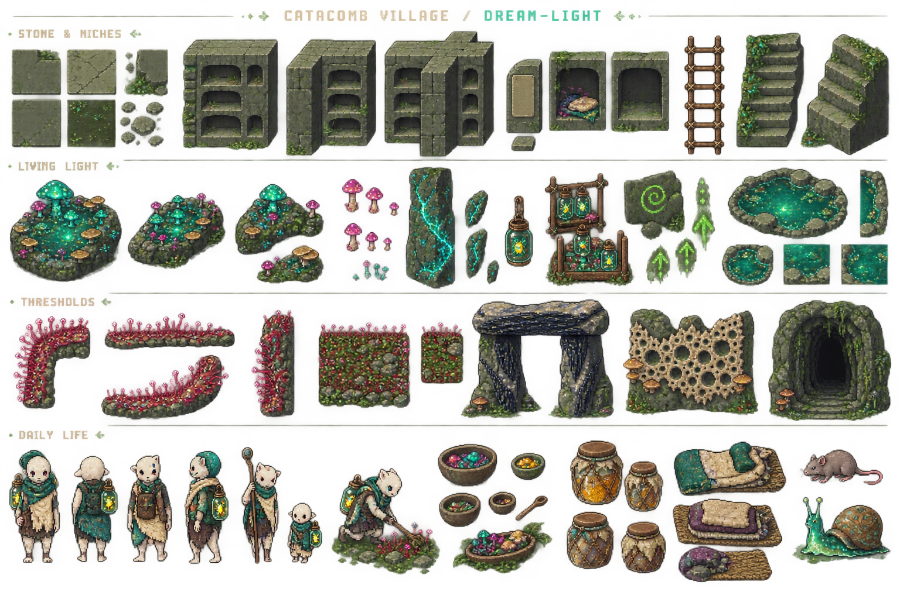
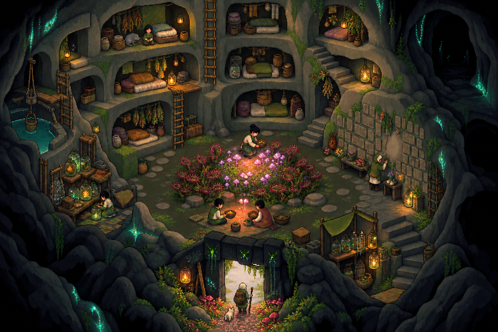

# Felling — tileset and scene studies

Six exploratory images generated with **built-in imagegen**, paired to review how a material vocabulary works both as isolated assets and in an inhabited scene. All six selected PNGs are 1536×1024. The exact generation inputs are preserved in [prompts.json](prompts.json), with two targeted corrections in [refinement-prompts.json](refinement-prompts.json). [manifest.json](manifest.json) records the selected source files.

These are art-direction references. They are not engine-ready atlases, verified seamless tiles, or approved additions to canon. Their grids and apparent pixels require manual production work before import.

## 1. Sill — ordinary life after the Felling

[Tileset](01-sill-tileset.png) · [Scene](02-sill-scene.png)

**Study:** repaired timber, river-stone, thatch, dark water, a working landing and a modest Concord stall. A small field of conjured festival flowers gives color a human purpose. The worn tree-carved lintel places old cosmology quietly inside daily life.

**Review for:** a clear river silhouette, traversable lanes, cottages and banks that could become modules, small actors visible against the ground, and flowers that remain a focal accent.

**Lore anchors:** Sill is a farming and fishing village on a slow river where the Tree is a children's story ([Geography §II](../../../Lore/History/02_Geography.md#ii-the-places-30-authored)). Timber, river-stone, thatch and half-forgotten tree-carved lintels establish its material baseline ([Material Culture §VII](../../../Lore/History/08_MaterialCulture.md#vii-per-faction-material-culture-the-open-factions-filled)). Ordinary flower-charms belong to the setting's tonal core ([Bible §I](../../../Lore/10_Bible.md#i-the-world-in-one-paragraph)).

## 2. The Stump — six places and an absence

[Tileset](03-stump-tileset.png) · [Scene](04-felling-site-scene.png)

**Study:** pink-grey sandstone, cream fossil seams, root-buttress ribs, blackwater, sundews and sima edges. The traveler approaches a present-day place shaped by an event roughly 1,080 years earlier.

**Review for:** geology that reads as petrified tree anatomy; consistent grain across possible tile boundaries; exactly six plain, plantless positions; and a seventh position conveyed by a small discontinuity. An extra patch, pedestal, symbol or dramatic portal would need correction before production.

**Lore anchors:** the Felling ascended six mortals, Naming had no bearer, and the surviving Root sleeps below the stump ([Bible §IV](../../../Lore/10_Bible.md#iv-the-canon-lock--the-spine-everything-must-agree-with)). The six sterile positions and seventh point of wrong air remain at the surface base ([Geography §II](../../../Lore/History/02_Geography.md#ii-the-places-30-authored)). Tepui formations carry fossilized anatomy ([Spine §IV](../../../Lore/History/01_Spine.md#iv-the-cataclysm-and-the-long-aftermath-1080-years)); Tepuibone is sandstone from the Root itself ([Material Culture §VI](../../../Lore/History/08_MaterialCulture.md#vi-stones--minerals)).

## 3. Catacomb village — the tended hearth

[Tileset](05-catacomb-tileset.png) · [Scene](06-catacomb-scene.png)

**Study:** an excavated village organized around a cultivated fungal patch. Wall niches hold bedding and belongings; plaques keep names; Drosera, Spore-Block and Choir-Iron protect thresholds. Beetle jars, quartz and slime-paint form a practical light system.

**Review for:** domestic warmth, legible routes around the hearth, distinct niche modules, understandable tending access through the sundew ring, and darkness beyond the useful light. The village should read as a home whose infrastructure is strange.

**Lore anchors:** homes and future tombs share wall niches; a central patch, plaque-wall, hatchery and layered light define village architecture ([Catacomb Village Design §IV](../../../catacomb_village_design.md#iv-architecture-and-infrastructure)). The Rooted's dreams manifest as village bio-light ([Catacomb-villagers §I](../../../Lore/Factions/06_CatacombVillagers.md#i-founding--the-rooted)). The first villagers followed familiar fungal light underground after leaf-light failed ([History](../../../Lore/History/03_History.md)).

## Canon and art proposals

The authority order is [the Bible](../../../Lore/10_Bible.md), amended by [the Second Spine](../../../Lore/11_SecondSpine.md), with the [Mystery Ledger](../../../Lore/MYSTERY-LEDGER.md) protecting unanswered questions. History supplies aligned detail; see the [lore reading guide](../../../Lore/README.md).

- The world predates the Tree: its binding overwrote older chaos. These images show current places and do not explain a complete earlier world.
- Urqu is pressure without a continuous self or plan. Visual absence must preserve that distinction.
- Naro's reasons and rightness remain unresolved to the player. The Felling-Site is an aftermath study, not eyewitness evidence of the refusal.
- The Root's unknown dreams remain unknown. Cultivated light can be shown without illustrating their hidden content.
- Palettes, exact layouts, clothing silhouettes, prop arrangements, the watermill staging and the smoothed plaque patch are art proposals. The plaque patch does not establish a new canonical erasure or event.

## Production direction

**Visual review:** all six images inspected. The selected Felling scene retains six barren patches and a restrained seventh discontinuity; a refinement replaced invented wall carvings with fossil wood grain. The selected catacomb scene replaces jaw-shaped flytraps with dew-tipped sundews. Sill keeps the ordinary river-village setting and small flower field. Remaining concept limitations include much finer detail than native sprites, variable apparent pixel scale, a floating heart accent beside the Stump-sheet frog, some built-looking stone modules, and differing actor proportions between the catacomb sheet and scene. These require interpretation and redraw during production; the sheets are not a validated tile topology or palette specification.

The prompts apply **Muted Overgrowth** and the [Visual Identity Bible](../../VISUAL-IDENTITY-BIBLE.md): restrained earth and stone, crisp clusters, square-grid terrain, stronger actor/interactable contrast, and localized living color.

1. Choose the strongest material and silhouette ideas from each pair; record corrections from visual review, especially the Felling-Site count and scale consistency.
2. Manually author terrain at **16×16** and moving actors on **16×24** canvases with a bottom-center pivot. Redraw clean pixel clusters and remove concept-sheet captions before slicing.
3. Build complete ground transitions, wall corners, junctions and repeatable edges. Slice and label authored modules with explicit pivots, collision and walkability; do not auto-slice the generated sheets as finished assets.
4. Assemble one representative screen per biome and inspect at native gameplay scale. Check actor readability, silhouette contrast, repeated seams, path width, occlusion and the difference between light sources and walkable ground.
5. Import the selected production assets with the project's pixel-art settings, then verify the scene in-engine before expanding the set.
